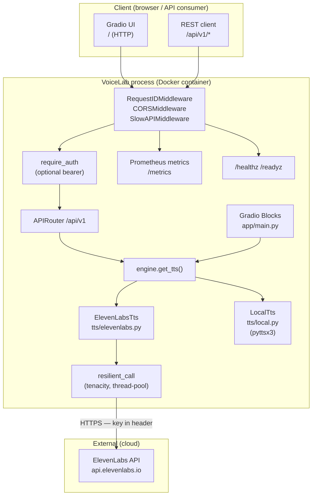

# VoiceLab — Architecture

## Overview

VoiceLab is a stateless FastAPI + Gradio application that exposes a voice/persona design playground. It integrates with the ElevenLabs cloud TTS API when an API key is present and falls back to a local pyttsx3 system-TTS backend when none is configured. All synthesis paths are gated through a single engine function (`engine.get_tts()`), ensuring a consistent fallback contract.

---

## Components

```
voicelab/
├── app/main.py          — FastAPI factory; mounts Gradio at /; exposes /healthz, /readyz, /metrics
├── api/v1.py            — REST router at /api/v1 (voices, personas, synthesize, compare, clone)
├── engine.py            — get_tts() backend selector; synthesize_one(); compare()
├── tts/
│   ├── elevenlabs.py    — ElevenLabsTts (cloud backend, key-gated, resilient)
│   └── local.py         — LocalTts (pyttsx3 system-TTS fallback, graceful no-op)
├── contracts.py         — Tts Protocol (structural typing)
├── resilience.py        — resilient_call(): timeout/retry/backoff via tenacity
├── validation.py        — validate_audio(): upload size ≤ 15 MB, duration ≤ 120 s
├── auth.py              — optional bearer-token dependency (require_auth)
├── middleware.py        — RequestIDMiddleware (UUID4 X-Request-ID header)
├── logging_config.py    — JSON logging + SecretRedactionFilter
├── metrics.py           — Prometheus counters/histograms (graceful no-op without prometheus_client)
├── personas.py          — Persona dataclass; load_personas() from YAML
├── personas.yaml        — 5 built-in persona presets
├── config/settings.py   — pydantic-settings; .env + config.yaml deep-merge
└── cli.py               — voicelab serve --port
```

---

## Data Flow

### Synthesis path

```
User input (text, voice, settings)
        │
        ▼
engine.get_tts()
 ├── ELEVENLABS_API_KEY set + elevenlabs pkg installed?
 │     └── YES → ElevenLabsTts(api_key)
 │              └── resilient_call(sdk.text_to_speech.convert, timeout=30s, retries=2, backoff=0.5s)
 │                    ├── success → MP3 bytes
 │                    └── failure → returns None (TransientError / NonTransientError caught)
 └── NO (no key or ImportError)
       └── LocalTts()
              └── pyttsx3.init(); save_to_file → /tmp WAV; read → bytes
                    └── any exception → returns None
        │
        ▼
Gradio UI (app/main.py)
 ├── WAV bytes → numpy array via wave module → gr.Audio(type="numpy")
 └── MP3 bytes → NamedTemporaryFile in /tmp (unique per request) → gr.Audio path
```

### Compare path

The Compare tab calls `tts.synthesize()` twice in sequence — once for Voice A settings, once for Voice B — and returns both audio outputs side-by-side. The same backend instance handles both calls.

### Clone path

```
POST /api/v1/clone (multipart form)
 ├── consent=true required — HTTP 400 if missing
 ├── ELEVENLABS_API_KEY required — HTTP 501 if absent
 ├── UploadFile → NamedTemporaryFile in /tmp
 ├── validate_audio(path): size ≤ 15 MB, duration ≤ 120 s (requires soundfile)
 └── ElevenLabsTts.clone_voice(path, name)
       └── ElevenLabs SDK voices.add() via resilient_call
             └── returns voice_id string or None
```

### Backend banner

`_backend_label()` in `app/main.py` checks `settings.elevenlabs_api_key` at render time. The Gradio header always displays either `"ElevenLabs (cloud) ✓"` or `"Local system TTS (pyttsx3 fallback) — set ELEVENLABS_API_KEY..."`. This is also reflected in `/healthz` and `/readyz` JSON responses.

---

## Architecture Diagram (trust boundaries)



---

## Resilience

All ElevenLabs SDK calls pass through `resilient_call()` in `resilience.py`:

| Parameter | Default | Config key |
|---|---|---|
| Timeout per attempt | 30 s | `ELEVENLABS_TIMEOUT` |
| Retry attempts (after first) | 2 | `ELEVENLABS_RETRIES` |
| Backoff base | 0.5 s | `ELEVENLABS_BACKOFF_BASE` |

Retry policy:
- **Transient** (retried with exponential backoff): `TimeoutError`, connection errors, HTTP 408/429/5xx
- **Non-transient** (raised immediately, no retry): HTTP 4xx (except 408/429)
- Each attempt runs in a dedicated `ThreadPoolExecutor(max_workers=1)` to enforce the wall-clock timeout without blocking the async event loop.

`ElevenLabsTts` catches both `TransientError` and `NonTransientError` and returns `None` — callers never receive an exception from the cloud backend.

---

## Deployment

### Docker (recommended)

The image is built from `python:3.12-slim` with `uv` for dependency resolution. The app runs as a non-root user (`uid 1000`).

```bash
# Build and run
docker compose up --build

# Manual build
docker build -t voicelab .
docker run --env-file .env -p 8001:8001 voicelab
```

`docker-compose.yml`:
```yaml
services:
  voicelab:
    build: .
    ports:
      - "8001:8001"
    env_file: .env
    restart: unless-stopped
```

Required `.env` keys:

```
ELEVENLABS_API_KEY=sk-...   # optional — omit for keyless/local mode
AUTH_TOKEN=...              # optional — enables bearer auth on /api/v1/*
LOG_LEVEL=INFO
```

The Docker `HEALTHCHECK` polls `GET /healthz` every 30 s with a 5 s timeout.

### Local dev

```bash
uv sync                          # base deps
uv sync --extra cloud            # add ElevenLabs SDK
uv run voicelab serve --port 8001
```

---

## Observability

### Health endpoints

| Endpoint | Purpose | Response |
|---|---|---|
| `GET /healthz` | Liveness — is the process running? | `{"status": "ok", "backend": "ElevenLabs" \| "Local (system TTS fallback)"}` |
| `GET /readyz` | Readiness — is the app ready to serve? | `{"status": "ok", "backend": "..."}` |

Both return `200 OK` regardless of backend; the `backend` field shows which TTS engine is active.

### Metrics

`GET /metrics` returns Prometheus text format (requires `prometheus_client`, installed by default).

Custom TTS metrics (labels: `backend`, `outcome`):

| Metric | Type | Description |
|---|---|---|
| `tts_calls_total` | Counter | Total TTS synthesis calls |
| `tts_latency_seconds` | Histogram | Per-call latency in seconds; buckets at 0.1, 0.25, 0.5, 1.0, 2.5, 5.0, 10.0 s |

Labels: `backend` ∈ `{elevenlabs, local}`, `outcome` ∈ `{ok, error}`.

Standard FastAPI/uvicorn process metrics are also available via `prometheus_client.generate_latest()`.

### Request IDs

`RequestIDMiddleware` attaches a UUID4 to every request via the `X-Request-ID` response header and `request.state.request_id`. The JSON log formatter includes `request_id` in every log line.

### JSON logs

All log output is structured JSON (`python-json-logger` or a minimal fallback). Fields: `time`, `level`, `logger`, `message`, `request_id`. API keys, bearer tokens, and `key=`/`token=` query params are redacted to `[REDACTED]` by `SecretRedactionFilter` before emission.

---

## Scaling Story

VoiceLab is designed to be **stateless** — no per-instance disk state, no shared memory between workers.

**What scales horizontally without coordination:**
- Multiple container replicas behind a load balancer
- Each request is self-contained; per-request temp files are written to `/tmp` and never shared

**External dependency: ElevenLabs API**
- The ElevenLabs API is the sole external bottleneck
- Each synthesis call holds an HTTPS connection open for up to 30 s (streaming response)
- ElevenLabs enforces per-account rate limits (tier-dependent); HTTP 429 is classified as transient and retried with backoff
- Cost is per-character synthesized — bulk Compare calls double the character count

**Per-request temp files**
- The Gradio layer writes MP3 output to `NamedTemporaryFile(dir="/tmp", delete=False)` for serving
- These files are not cleaned up automatically; the OS will reclaim them on reboot or if `/tmp` is mounted as `tmpfs`
- In production, set up a cron or use a shared ephemeral volume with a TTL; `/tmp` should not be a persistent volume

**LocalTts concurrency**
- `pyttsx3` initialises a new engine per call — it is not thread-safe for shared instances
- Each synthesis call is short-lived; under high concurrency, multiple simultaneous `pyttsx3.init()` calls may race on audio hardware
- For production local TTS, consider a queue-based approach or a dedicated TTS microservice
