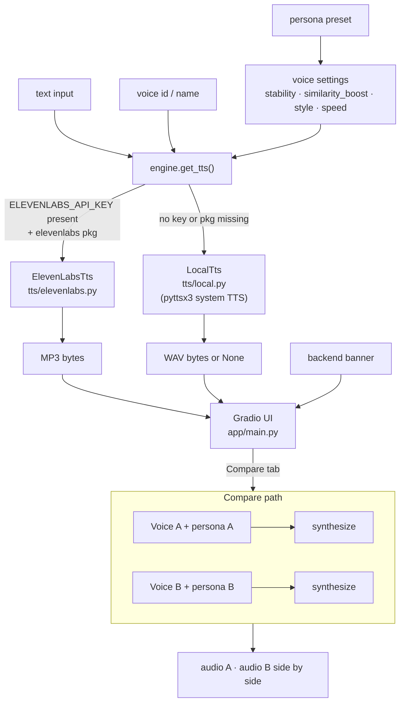

# VoiceLab — ElevenLabs voice/persona playground

Design, compare, and clone agent voices without writing a line of Python. VoiceLab is a local Gradio + FastAPI UI backed by ElevenLabs — or your system's built-in TTS if you have no API key.

> 📖 Live docs: https://arslankazmi.github.io/voicelab/

## What it does

- **Synthesize tab** — pick a persona preset (or tune manually) and preview any voice
- **Compare tab** — synthesize the same text through two voices side by side, each with its own persona and settings
- **Voice Cloning tab** — upload a WAV/MP3 sample to clone a voice via the ElevenLabs API (key + Professional plan required; gated stub)
- **Keyless mode** — no ElevenLabs key? `LocalTts` falls back to pyttsx3 system TTS so development and CI always work

## Architecture



<details>
<summary>ASCII fallback</summary>

```
text + persona + settings
         |
         v
   engine.get_tts()
    /             \
key present?    no key / pkg missing
    |                    |
ElevenLabsTts        LocalTts
(cloud, MP3)       (pyttsx3, WAV)
    \                    /
         Gradio UI
       /           \
  Synthesize     Compare
  (single)     (A vs B, side by side)
                |
           Voice Cloning tab
           (cloud only — gated)
```

</details>

## Quick start

You need Python 3.12+ and [uv](https://docs.astral.sh/uv/).

```bash
# clone and install (base deps — no ElevenLabs key needed)
git clone https://github.com/arslankazmi/voicelab && cd voicelab
uv sync

# serve (keyless mode — system TTS fallback)
uv run voicelab serve --port 8001
# open http://localhost:8001

# to unlock ElevenLabs cloud synthesis:
uv sync --extra cloud
export ELEVENLABS_API_KEY=your_key_here
uv run voicelab serve --port 8001
```

## Development

All 17 tests run without an ElevenLabs key or audio hardware:

```bash
uv run pytest
# 17 passed
```

The backends degrade gracefully in CI — `LocalTts` logs a warning if pyttsx3 is unavailable and returns `None`; tests assert on this behaviour explicitly.

## License & credits

MIT. See [ASSET_CREDITS.md](ASSET_CREDITS.md) for library and service attributions.
